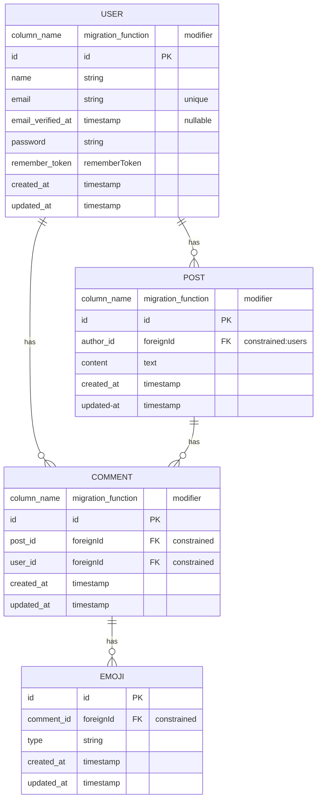

# Relation On Pivot Table

## ER model



## Setup Project

1. Set DB_DATABASE

```shell
cp .env .env.example
```

2. Generate app key

```shell
php artisan key:generate
```

3. Install dependencies

```shell
composer install

npm install
```

4. Migrate database tables

```shell
php artisan migrate
```

## Demo commands

```shell
php artisan tinker

$user = User::factory()->has(Post::factory())->create()
$post = $user->posts()->first()
$user->commentedPosts()->attach($post, ['comment' => 'test'])
$comment = $user->commentedPosts()->first()->pivot
$comment->emojis()->create(['type' => 'like']);

# Load data
$users = User::with('commentedPosts')->get()
$users = $users->map(function ($user, $key) {
    $user->commentedPosts = $user->commentedPosts->map(function ($post, $key) {
        return $post->pivot->load('emojis');
    });

    return $user;
})

# Show results
$users
```
